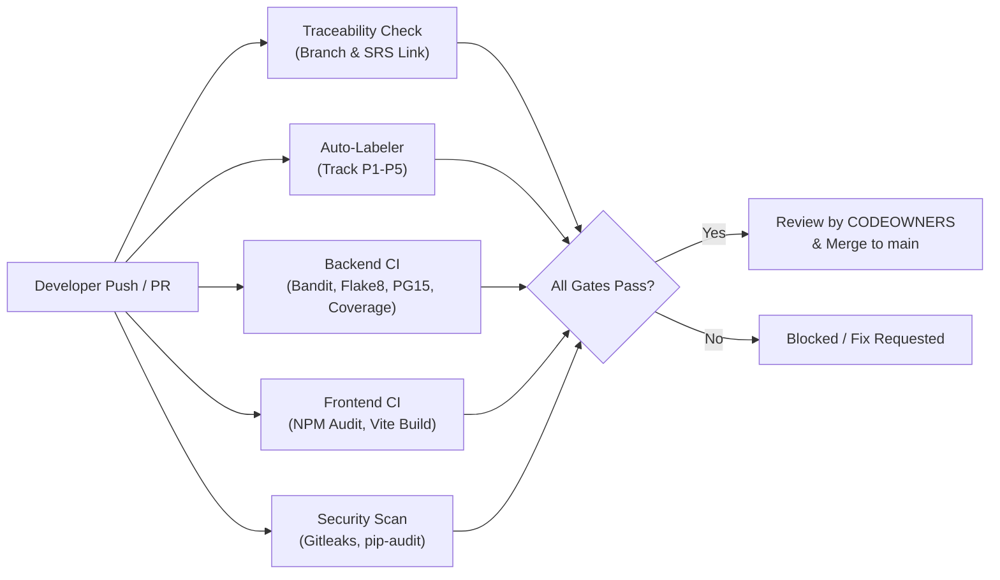

# 🎓 Cognify LMS — Smart Learning Management System
> **Database Management Systems (DBMS) Course Project**  
> An intelligent, scalable online learning platform with dual-tier storage (PostgreSQL + Redis), automated assessments, video tracking, real-time leaderboards, and AI-powered study tools.

[](https://github.com/armoredglock/cognify-lms/actions/workflows/backend-ci.yml)
[](https://github.com/armoredglock/cognify-lms/actions/workflows/frontend-ci.yml)
[](https://github.com/armoredglock/cognify-lms/actions/workflows/security-scan.yml)
[](https://github.com/armoredglock/cognify-lms/actions/workflows/traceability-check.yml)

---

## 👥 Project Team & Responsibility Allocation

| # | Team Member | GitHub Handle | Role & Task Section | Primary Scope & DBMS Modules |
|:-:|:---|:---|:---|:---|
| **1** | **Saanvi Singhal** *(Team Lead)* | [@saanvi-singhal](https://github.com/saanvi-singhal) | **Core Architecture & Course Schema** | Custom RBAC User model, Course/Module/Lesson schema, Foreign Keys, cascades, and catalog APIs. |
| **2** | **Bibek Tripathy** | [@bibek-tripathy](https://github.com/bibek-tripathy) | **Video Analytics & Redis Playback Cache** | Redis caching for video playback heartbeats, durable sync to `LessonProgress`, watch-time analytics. |
| **3** | **Swati Saumya** | [@swatisaumya](https://github.com/swatisaumya) | **Assessment Engine & Redis Timed Sessions** | Quiz/Question schema, Redis TTL session key management for timed exams, atomic submission engine. |
| **4** | **Meheli Ghosh** | [@meheli-ghosh](https://github.com/meheli-ghosh) | **Gamification & Certification Engine** | Real-time Leaderboards with Redis Sorted Sets (`ZSET`), SQL aggregation gradebooks, certificate hashes. |
| **5** | **Sagnik Datta** | [@armoredglock](https://github.com/armoredglock) | **AI Assessment Generator & Frontend UI** | AI schema for generated MCQs/flashcards, transcript processing pipeline, React student dashboard. |

*Co-Leads (@armoredglock and @saanvi-singhal) act as dual codeowners to facilitate continuous PR review and testing.*

---

## 🏛️ System Architecture

Cognify LMS adopts a hybrid relational + in-memory data architecture designed for high throughput, data integrity, and ACID compliance:

```
                  ┌─────────────────────────────────────┐
                  │          React Frontend UI          │
                  │   (Vite + React Router + Context)   │
                  └──────────────────┬──────────────────┘
                                     │ REST API
                                     ▼
                  ┌─────────────────────────────────────┐
                  │      Django REST Framework API      │
                  │      (ACID Transactions, RBAC)      │
                  └─────────┬─────────────────┬─────────┘
                            │                 │
             Persistent Data│                 │Fast Cache & Timers
                            ▼                 ▼
          ┌────────────────────────┐   ┌────────────────────────┐
          │  PostgreSQL (Relational)│   │   Redis (In-Memory)    │
          │  - 3NF Schema          │   │  - Playback Heartbeats │
          │  - Users & RBAC        │   │  - Quiz Session TTLs   │
          │  - Courses & Lessons   │   │  - Sorted Leaderboards │
          │  - Quiz Attempts       │   └────────────────────────┘
          │  - Certificates        │
          └────────────────────────┘
```

---

## 🗄️ DBMS Design & High-Scoring Features

### 1. Relational Database Design (PostgreSQL)
- **3NF Normalization**: Fully decoupled entities eliminating data anomalies across courses, modules, lessons, enrollments, and quiz questions.
- **ACID Transactions**: Quiz submission and grading use atomic transactions (`@transaction.atomic`) with database row-level locking to prevent race conditions during concurrent submissions.
- **Indexing Strategy**: B-Tree indexes on `category`, `instructor_id`, and `created_at`; composite indexes on `(student_id, lesson_id)` for instantaneous query resolution.
- **Entity Relationship Model**: Documented in detail in [`docs/DBMS_ER_DIAGRAM.md`](docs/DBMS_ER_DIAGRAM.md).

### 2. In-Memory Performance Layer (Redis)
- **Video Heartbeat Ingestion**: High-frequency video playback ticks update Redis hashes (`video:user:{uid}:lesson:{lid}`) instead of executing costly disk writes on PostgreSQL. Data syncs durably to PostgreSQL on milestone completion.
- **Timed Exam Session TTL**: Redis keys (`quiz_session:{attempt_id}`) automatically expire when the exam duration elapses, preventing late submissions.
- **Real-Time Leaderboards**: Redis Sorted Sets (`leaderboard:course:{id}`) enable instant $O(\log N)$ rank lookups and range queries (`ZADD`, `ZREVRANGE`).

---

## 📁 Repository Structure

```
cognify-lms/
├── .github/
│   ├── CODEOWNERS                      # Dual lead and section ownership mapping
│   ├── ISSUE_TEMPLATE/                 # Structured bug and task templates
│   ├── workflows/
│   │   ├── traceability-check.yml      # CI gate enforcing SRS requirement traceability
│   │   ├── backend-ci.yml              # CI checking migrations, checks & tests
│   │   └── frontend-ci.yml             # CI validating React production build
│   └── pull_request_template.md
├── docs/
│   ├── DBMS_ER_DIAGRAM.md             # Complete Mermaid ER diagram and table specs
│   └── TRACEABILITY.md                # Full requirements-to-files matrix
├── backend/
│   ├── manage.py
│   ├── requirements.txt
│   ├── config/                        # Core Django settings, URLs, and Redis config
│   ├── apps/
│   │   ├── users/                     # [P1 Saanvi] Auth & custom RBAC user model
│   │   ├── courses/                   # [P1 Saanvi] Course, Module, Lesson models & APIs
│   │   ├── tracking/                  # [P2 Bibek] Video progress tracking & sync
│   │   ├── assessments/               # [P3 Swati] Quiz, questions, attempts & grading
│   │   ├── gamification/              # [P4 Meheli] Leaderboard & certificate engine
│   │   └── ai_generator/              # [P5 Sagnik] AI transcript MCQ & summary generator
│   └── services/
│       ├── redis_cache.py             # Playback cache helper
│       ├── exam_session.py            # Timed session manager
│       └── leaderboard.py             # Sorted set rank engine
├── frontend/
│   ├── package.json
│   ├── vite.config.js
│   └── src/                           # React UI components, router, and contexts
├── CONTRIBUTING.md                    # Agile workflow, branch conventions & PR rules
├── SECURITY.md                        # Responsible vulnerability reporting policy
└── README.md
```

---

## 🚀 Getting Started (Local Setup — No Docker Required)

### Prerequisites
- Python 3.10+
- Node.js 18+ & npm
- PostgreSQL (running locally on port 5432)
- Redis (running locally on port 6379, e.g. via Memurai or native Redis)

### 1. Clone Repository
```bash
git clone https://github.com/armoredglock/cognify-lms.git
cd cognify-lms
```

### 2. Backend Setup
```bash
cd backend
python -m venv venv

# Windows activate:
venv\Scripts\activate
# Mac/Linux activate:
# source venv/bin/activate

pip install -r requirements.txt

# Run migrations & verify database connection
python manage.py migrate
python manage.py runserver
```
Backend API will be running at `http://127.0.0.1:8000/`.

### 3. Frontend Setup
```bash
cd ../frontend
npm install
npm run dev
```
Frontend interface will be running at `http://localhost:5173/`.

---

## ⚙️ Automated CI/CD Pipelines & Quality Gates

Cognify LMS integrates **5 automated GitHub Actions workflows** to guarantee code quality, database migration safety, and cybersecurity:



| Pipeline | Target & Scope | Key Automated Verifications |
| :--- | :--- | :--- |
| **`backend-ci.yml`** | Django & DBMS | **Bandit SAST** (SQL injection/vulnerability scan), **Live PostgreSQL 15 migration run**, migration drift check, Flake8, test coverage. |
| **`frontend-ci.yml`** | React Single-Page App | `npm audit` dependency security audit, strict Vite production bundle smoke test. |
| **`security-scan.yml`** | Repository Shield | **Gitleaks** secret & credential scanning, **pip-audit** Python package CVE checks. |
| **`traceability-check.yml`** | Agile Process | Validates branch convention (`<owner>/feat/<slug>-<req-id>`), enforces SRS requirement ID, posts automated sticky status report. |
| **`pr-auto-labeler.yml`** | Workflow Automation | Inspects modified files and auto-applies module labels (`track:p1-core` through `track:p5-ai-frontend`). |

> 📖 **Full Architectural Documentation**: See [`docs/CI_CD_WORKFLOW.md`](docs/CI_CD_WORKFLOW.md) for detailed pipeline flows, test outputs, and local developer guides.

---

## 🔄 Agile Development & Contribution

1. Review requirements in [`docs/TRACEABILITY.md`](docs/TRACEABILITY.md).
2. Create a branch following the naming rule: `<owner>/feat/<task-name>-<req-id>`  
   *(Example: `saanvi/feat/course-models-LMS-CRS-02`)*
3. Write clean commits referencing the requirement ID.
4. Open a PR using the automated template. CI will automatically verify traceability and migration integrity.
