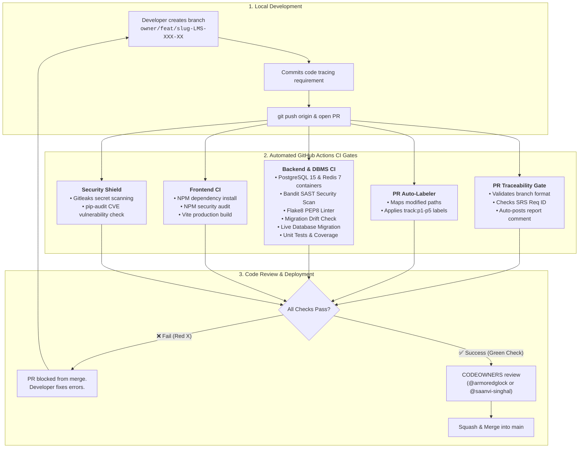

# 🔄 CI/CD Pipeline & Automated Quality Gates — Cognify LMS

Cognify LMS employs an automated **Continuous Integration and Continuous Deployment (CI/CD)** pipeline powered by **GitHub Actions**. This ensures that code contributed by all 5 team members adheres to strict database integrity, agile requirement traceability, code formatting, and cybersecurity standards.

---

## 1. High-Level CI/CD Workflow Architecture

When a team member opens a Pull Request or pushes to `main`, GitHub Actions orchestrates five automated pipelines in parallel:



---

## 2. Pipeline Breakdown

### Pipeline 1: Agile Traceability & Branch Compliance
* **File**: [`.github/workflows/traceability-check.yml`](../.github/workflows/traceability-check.yml)
* **Trigger**: Any Pull Request (`opened`, `edited`, `synchronize`, `reopened`).
* **What it checks**:
  1. **Branch Naming Standard**: Verifies branch matches `<owner>/<type>/<slug>-<req-id>` (e.g. `saanvi/feat/custom-user-LMS-AUTH-01`).
  2. **Requirement Traceability**: Checks PR title and description for an assigned SRS ID (e.g. `[LMS-AUTH-01]` or `[no-req]`).
  3. **Automated PR Bot**: Posts a sticky comment with a status report on the PR:
     ```markdown
     ### 📋 Agile Traceability CI Report
     - Requirement Traced: ✅ [LMS-AUTH-01]
     - Branch Naming: ✅ Compliant with <owner>/<type>/<slug>-<req-id>
     - Traceability Matrix: Refer to docs/TRACEABILITY.md
     ```

---

### Pipeline 2: PR Module Auto-Labeler
* **File**: [`.github/workflows/pr-auto-labeler.yml`](../.github/workflows/pr-auto-labeler.yml) & [`.github/labeler.yml`](../.github/labeler.yml)
* **Trigger**: Any Pull Request targeting `main`.
* **What it does**: Inspects modified file paths and instantly assigns appropriate track labels:
  - Touched `backend/apps/users/` or `courses/` $\rightarrow$ `track:p1-core`
  - Touched `backend/apps/tracking/` or `redis_cache.py` $\rightarrow$ `track:p2-tracking`
  - Touched `backend/apps/assessments/` or `exam_session.py` $\rightarrow$ `track:p3-assessments`
  - Touched `backend/apps/gamification/` or `leaderboard.py` $\rightarrow$ `track:p4-gamification`
  - Touched `backend/apps/ai_generator/` or `frontend/` $\rightarrow$ `track:p5-ai-frontend`
  - Touched database models or services $\rightarrow$ `dbms-focus`

---

### Pipeline 3: Backend & DBMS Integrity CI
* **File**: [`.github/workflows/backend-ci.yml`](../.github/workflows/backend-ci.yml)
* **Trigger**: Push to `main` or Pull Requests touching `backend/**`.
* **Services**: Spawns isolated **PostgreSQL 15** and **Redis 7** Docker containers inside GitHub Actions runner.
* **Execution Steps**:
  ```
  1. python -m pip install -r backend/requirements.txt
  2. bandit -r backend/apps backend/services backend/config -ll -i (SAST Security)
  3. flake8 backend --max-line-length=120 (PEP8 Styling)
  4. python manage.py check (Django system validation)
  5. python manage.py makemigrations --check --dry-run (Migration drift detection)
  6. python manage.py migrate (Live PostgreSQL migration execution)
  7. coverage run manage.py test (Automated test suite)
  8. coverage report -m (Test coverage metrics)
  ```
* **Why this matters for DBMS evaluation**:
  - **No Missing Migrations**: If an engineer modifies `models.py` but forgets to commit the migration file, step 5 immediately rejects the PR.
  - **Live Database Migration**: Step 6 actually executes the SQL migrations against a live PostgreSQL 15 database to guarantee zero syntax or constraint errors.
  - **SQL Injection Prevention**: Bandit audits Django ORM usage and blocks raw, unsafe SQL queries.

---

### Pipeline 4: Frontend Build & Security Audit
* **File**: [`.github/workflows/frontend-ci.yml`](../.github/workflows/frontend-ci.yml)
* **Trigger**: Push to `main` or Pull Requests touching `frontend/**`.
* **Execution Steps**:
  1. `npm install`: Clean installation of React dependencies.
  2. `npm audit --audit-level=high`: Audits frontend dependencies for high-severity CVE vulnerabilities.
  3. `npm run build`: Executes Vite production bundling to catch JSX syntax errors, missing imports, or build breaks.

---

### Pipeline 5: Security & Secret Detection Shield
* **File**: [`.github/workflows/security-scan.yml`](../.github/workflows/security-scan.yml)
* **Trigger**: Push to `main` or Pull Requests.
* **Execution Steps**:
  1. **Gitleaks**: Deep git-history scanning for accidentally leaked API keys, tokens, or private secrets.
  2. **pip-audit**: Cross-references installed Python packages against the PyPA Advisory Database to ensure no vulnerable libraries are introduced.

---

## 3. Developer Local Pre-Flight Checklist

To ensure your PR passes all CI checks on the first attempt, run these commands locally before pushing:

```bash
# 1. Ensure working on a properly named feature branch:
git checkout -b <your-name>/feat/<feature-name>-<REQ-ID>

# 2. Check for uncommitted database migrations:
python manage.py makemigrations --check --dry-run

# 3. Verify Django system checks:
python manage.py check

# 4. Run tests:
python manage.py test

# 5. Verify frontend builds cleanly:
cd frontend && npm run build
```

---

## 4. How Code Reviews Work with CODEOWNERS

1. When a PR is opened, GitHub automatically requests reviews from:
   - The specific **Task Section Owner** (e.g., `@swatisaumya` for assessments, `@bibek-tripathy` for video tracking).
   - Either **Co-Lead** ([@armoredglock](https://github.com/armoredglock) or [@saanvi-singhal](https://github.com/saanvi-singhal)).
2. Once the **CI checks turn green** and at least one codeowner approves, the PR is merged into `main`.
