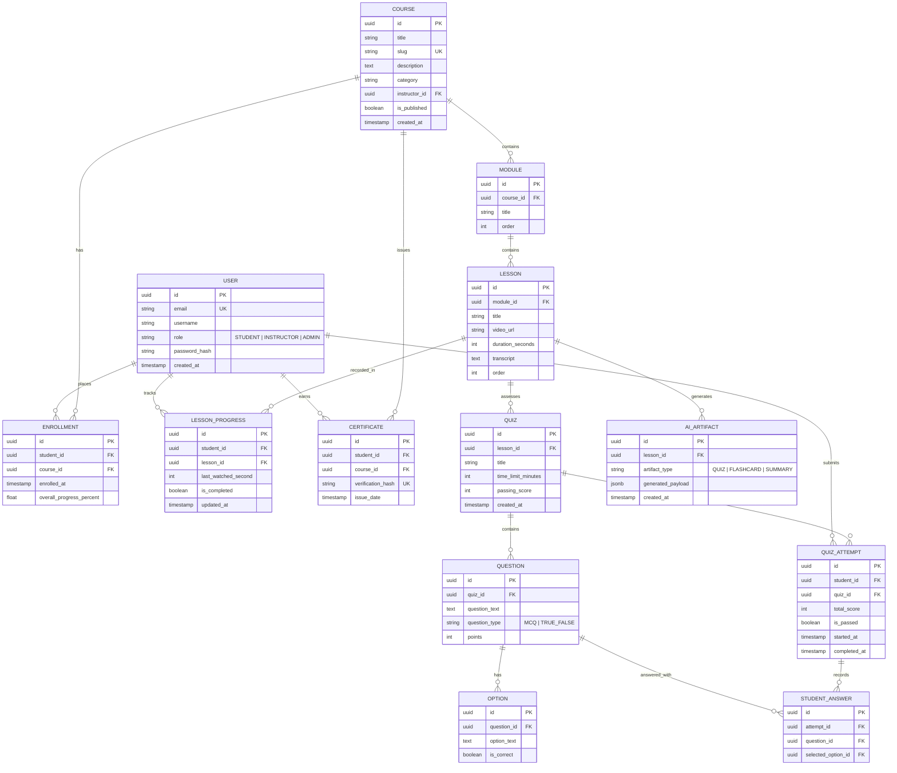

# DBMS Schema & Architecture Specification — Cognify LMS

## 1. System Architecture Overview

Cognify LMS employs a multi-tiered architecture with a hybrid data-storage strategy:
- **PostgreSQL**: Relational storage adhering to 3NF (Third Normal Form) for persistent data (users, courses, enrollments, quiz records, gradebooks, certificates, AI artifacts).
- **Redis**: In-memory high-throughput data store used for transient playback heartbeats, session TTL management for exams, and real-time sorted leaderboard sets.
- **Django REST Framework**: Backend application layer enforcing ACID transactions and business logic.
- **React (Vite)**: Single Page Application frontend.
- **AI Processing Pipeline**: Transcript summarizer and MCQ generator.

---

## 2. PostgreSQL Relational Entity-Relationship (ER) Diagram

---

## 3. Redis In-Memory Key Design & Caching Architecture

| Key Pattern | Data Structure | TTL | Purpose |
| :--- | :--- | :--- | :--- |
| `video:user:{uid}:lesson:{lid}` | Hash (`last_sec`, `updated_at`) | 24 Hours | Absorbs high-frequency video playback ticks without overloading PostgreSQL disk writes. |
| `quiz_session:{attempt_id}` | String / Hash (`quiz_id`, `start_time`) | Quiz duration + 2 min grace | Strict countdown enforcement. Submissions rejected after key expires. |
| `leaderboard:course:{course_id}`| Sorted Set (`ZSET`) | None (Persistent) | Real-time course ranking computed via score + progress points (`ZADD`, `ZREVRANGE`). |

---

## 4. Normalization & Indexing Strategy

1. **3NF Compliance**:
   - Every non-key attribute is dependent solely on the primary key (no transitive dependencies).
   - Quiz questions and options are decoupled from attempts, ensuring quiz edits do not distort historical scores.
2. **PostgreSQL Indexing**:
   - **Composite Index**: `(student_id, lesson_id)` on `LessonProgress` for $O(1)$ progress lookups.
   - **B-Tree Index**: `Course.category`, `Course.instructor_id`, and `Enrollment.student_id`.
   - **Unique Constraints**: Prevent duplicate enrollments (`student_id`, `course_id`) and unique certificate hashes.
